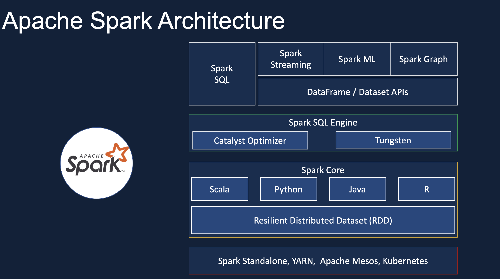
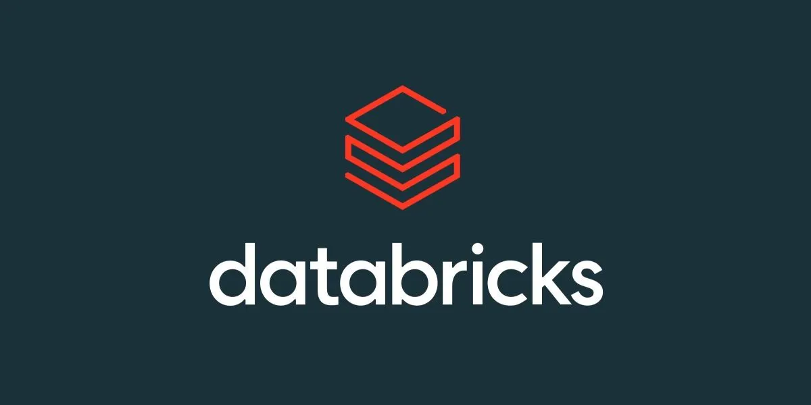

# IPL-Data-Analysis-using-Apache-Spark

## Introduction
This project focuses on analyzing data from the Indian Premier League (IPL) using modern data engineering techniques. We leverage tools like Apache Spark for data processing, PySpark for Python-based data manipulation, Amazon S3 for scalable data storage, and Databricks for managing workflows. The analysis involves building an ETL pipeline, performing SQL analytics, and visualizing insights using Seaborn and Matplotlib.

## Architecture
### Project Architecture

## Technology Used
- **Programming Language**: Python
- **Scripting Language**: SQL
- **Cloud Storage**: Amazon S3
- **Data Processing**: Apache Spark, PySpark
- **Workflow Management**: Databricks
- **Visualization**: Seaborn, Matplotlib
- **Data Pipeline Tool**: Apache Spark

## Dataset Used
The IPL dataset used in this project includes detailed information about IPL matches, players, teams, and seasons. The dataset captures match results, scores, player performances, and more.

**Dataset Source**: [IPL Dataset](Dataset)

More information about the dataset: 
- **Fields**: Match IDs, Player names, Teams, Scores, and other match statistics.
- **Data Dictionary**: A comprehensive dictionary of all the fields in the IPL dataset can be found [here](https://data.world/raghu543/ipl-data-till-2017/workspace/data-dictionary)
  
## Spark Overview
Apache Spark is a unified analytics engine for large-scale data processing and a set of libraries for parallel data processing on computer clusters. It provides an interface for programming entire clusters with implicit data parallelism and fault tolerance. Spark is known for its speed, ease of use, and sophisticated analytics.

### Spark Architecture

## Databricks Overview

Databricks is a cloud-based platform that provides a unified workspace for big data analytics and machine learning. It integrates seamlessly with Apache Spark, offering an optimized environment for Spark applications.

## Amazon S3 Overview

Amazon S3 (Simple Storage Service) is an object storage service that offers industry-leading scalability, data availability, security, and performance. In this project, S3 is used to store the IPL dataset efficiently.

## PySpark
PySpark is the Python API for Apache Spark, which allows Python developers to write Spark applications using the PySpark library. It provides an easy-to-use interface for scalable and efficient data processing and analysis on large datasets.

## SQL Analysis
SQL (Structured Query Language) is used to query and analyze the data stored in Spark. SQL queries help in aggregating, filtering, and joining data to derive meaningful insights.

## Visualization
Seaborn and Matplotlib are Python libraries used for data visualization. They help in creating plots and charts to represent data insights graphically.

## Conclusion
This project demonstrates the power of modern data engineering and analysis tools in extracting valuable insights from large datasets. By utilizing Apache Spark and PySpark on Databricks, along with Amazon S3 for storage and SQL for analysis, we can efficiently process and visualize IPL data, providing meaningful insights into the league's performance and trends.

